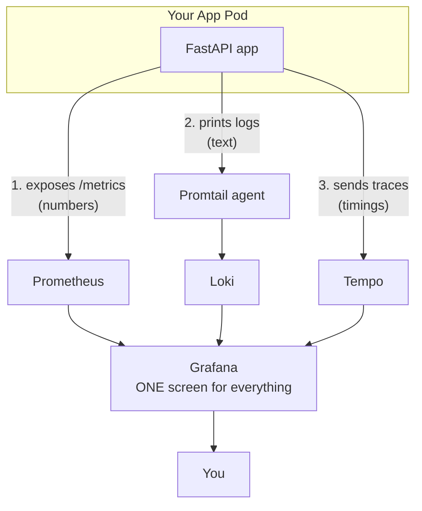

# Observability Stack: Prometheus + Loki + Tempo + Grafana

How to give a FastAPI service on EKS the three pillars of observability and
correlate them in a single Grafana pane.

## Start Here (plain-English intro)

**What is "observability"?** It's just being able to answer the question *"what
is my app actually doing right now?"* without SSH-ing into a server and guessing.

Think of your app like a **car**, and observability like the car's **dashboard**:

- **Metrics** = the gauges (speed, fuel, RPM). Numbers that go up and down over
  time. They tell you *that* something is wrong ("engine temp is high!").
- **Logs** = the car's diary. Text messages the app writes about what happened
  ("user 5 logged in", "DB query failed"). They tell you *why* it went wrong.
- **Traces** = a GPS trip recording. They follow ONE request through every step
  and time each step, so you can see *where* it got slow.

You need all three because each answers a different question:

| Pillar | The question it answers | Real-world analogy |
|---|---|---|
| **Metrics** | "Is something wrong, and how bad?" | Dashboard gauges |
| **Logs**    | "Why did it break? What exactly happened?" | The diary / black box |
| **Traces**  | "Which step was slow, and where?" | GPS route timeline |

**The 4 tools, in one sentence each:**

- **Prometheus** — collects and stores the *metrics* (numbers).
- **Loki** — collects and stores the *logs* (text). Promtail is its little helper
  that scoops logs off each node.
- **Tempo** — collects and stores the *traces* (request timelines).
- **Grafana** — the single website where you *look at* all three (the dashboard
  screen). It stores nothing itself; it just queries the other three.

**Two ways data is collected — remember "pull vs push":**

- **Pull** (Prometheus): the app just leaves its numbers at a `/metrics` URL.
  Prometheus walks over every 30s and reads them. The app does nothing active.
- **Push** (Loki & Tempo): the app (or a helper) actively *sends* data out — logs
  get shipped by Promtail, traces get sent straight to Tempo.

**The magic word: `trace_id`.** Every request gets a unique id. We stamp that
same id onto the request's trace AND every log line it produces. That shared id
is what lets you click from a slow trace straight to its exact log lines in
Grafana — turning 3 separate tools into one investigation.

If you only remember one thing: **app produces data → a store keeps it →
Grafana shows it.** Everything below is just the details of wiring that up.

---

## First, Your Current Understanding (it's correct!)

- Your app already exposes a `/metrics` URL full of numbers.
- Prometheus walks over every 30s and copies those numbers into its database.
- Grafana reads Prometheus and draws the graphs you look at.
- Alerts fire when a number crosses a threshold you defined.

That's metrics. You've got it. Now let's add the other two pillars on top of that
same idea.

---

## The Big Picture: 3 Types of Data

Think of observability like a **car dashboard**:

| Pillar | Car analogy | Question it answers | Tool |
|---|---|---|---|
| **Metrics** | Speedometer, fuel gauge | "Is something wrong?" | Prometheus |
| **Logs** | The mechanic's written notes | "Why did it break?" | Loki |
| **Traces** | GPS route history of one trip | "Where exactly was it slow?" | Tempo |

You already have the speedometer (Prometheus). We're adding the notes (Loki) and
the GPS history (Tempo).

---

## Each Tool = A Prometheus Twin

Here's the key insight that makes this less scary. **Each new tool works EXACTLY
like Prometheus**, just for a different data type:

- **Prometheus** stores *numbers* (metrics) and Grafana graphs them.
- **Loki** stores *text* (logs) and Grafana searches them — it's "Prometheus for logs".
- **Tempo** stores *traces* (request timelines) and Grafana draws them — it's "Prometheus for traces".
- All three are just a *database + a query API*; the only thing that changes is what kind of data goes in.

Same pattern three times. **Grafana is the single screen** that shows all three.
You don't learn 3 new UIs — just Grafana.

## How Each One Collects Data (the only real difference)

The **collection method** differs:

### Metrics — Prometheus *pulls*

- Your app sits still and exposes a `/metrics` page.
- Prometheus has a list of targets and visits each one on a timer (every 30s).
- It copies whatever numbers it finds into its own storage.
- The app never initiates anything — it's read *from*.

Prometheus reaches out and scrapes. (You know this already.)

### Logs — Promtail *pushes*

- Your app just prints log lines to stdout (the console) like normal.
- A helper called Promtail reads those console lines off the node.
- Promtail forwards them to Loki over the network.
- The app does zero extra work — printing is all it does.

- **Promtail** is a little agent on every node (a "DaemonSet" = one copy per node).
- It watches the log output of every pod and forwards it to Loki.
- Your app just prints logs normally — Promtail does the shipping.

### Traces — App *sends*

- Your app starts a "span" (a stopwatch) when a request comes in.
- It records each step — the route handler, the SQL query — as child stopwatches.
- When the request finishes, it bundles those timings into a trace.
- It sends that trace directly to Tempo over OTLP (a tracing protocol).

- Your app actively sends a trace after each request.
- That's what the OpenTelemetry code does — it times each step and ships it.

---

## What Are Those "Resources" I Created?

Let me demystify each file type:

### 1. ArgoCD Application (`argocd-app-tempo.yaml`)

**What:** A piece of paper that says "ArgoCD, please install Tempo for me."

- It names the Helm chart to install (e.g. `grafana/tempo`) and its version.
- It points at your Git repo for the settings (the values file).
- It says which namespace to install into (`monitoring`).
- It turns on auto-sync, so ArgoCD installs it and keeps it healthy forever.

It's just **automation**. Instead of you running install commands manually,
ArgoCD does it and keeps it running forever. You already use this for your app —
Tempo/Loki are the same idea.

### 2. Values file ([values-prod.yaml](eks-private-cluster/k8s/charts/app/values-prod.yaml))

**What:** The settings/config for that install.

Like filling out a form: "Tempo, store traces on disk, listen on port 4317."
Tempo is pre-built software (made by Grafana) — you don't write Tempo itself,
you just configure it.

### 3. ServiceMonitor

**What:** A sticky note telling Prometheus "also scrape my app."

- It's a small YAML object the Prometheus operator watches for.
- It points Prometheus at your app's Service and its `/metrics` path.
- It carries a `release: prometheus` label so the operator knows to pick it up.
- Without it, Prometheus has no idea your app exists to be scraped.

### 4. PrometheusRule

**What:** Your alarm conditions.

"IF error rate > 5% → fire an alert." Just if-then rules Prometheus checks
continuously.

---

## How It All Connects (one diagram)



Three data streams leave your app, land in three stores, all viewed in one
Grafana.

---

## The Payoff (why bother)

Once wired, here's the magic moment in Grafana:

- You see a **metric** spike — error rate jumps at 14:32. ("Something's wrong.")
- You click into the slow **trace** for that moment and see the SQL step took 3s. ("Where.")
- You click "Logs for this span" and land on the exact **log** line: `connection timeout`. ("Why.")
- All three are linked by the shared `trace_id` — no manual hunting across tools.

You go from "something's wrong" → "here's the exact line of code/cause" in 3
clicks. That's what the `trace_id` linking I configured does.

---

## Mental Model

Each tool follows the **same pull-or-push → store → view** shape. Grafana is the
one screen for all three.

| Pillar | Question | Collector → Store | How data leaves the app |
|---|---|---|---|
| **Metrics** | "Is something wrong?" | Prometheus (pulls) | App exposes `/metrics`; Prometheus scrapes every 30s |
| **Logs** | "Why did it break?" | Promtail → Loki (push) | App prints JSON to stdout; Promtail (DaemonSet) ships it |
| **Traces** | "Where was it slow?" | App → Tempo (push) | App sends OTLP gRPC spans after each request |

```
                 ┌─────────────── App Pod ───────────────┐
                 │  FastAPI                               │
                 │   ├─ /metrics  (numbers)  ──pull──▶ Prometheus ─┐
                 │   ├─ stdout    (JSON logs)──push──▶ Promtail→Loki┤
                 │   └─ OTLP      (spans)    ──push──▶ Tempo ───────┤
                 └────────────────────────────────────────┘        ▼
                                                              Grafana (one UI)
```

The payoff is **correlation**: a metric spike → click → the slow trace → click →
that request's logs. The glue is a single `trace_id` that appears in both spans
and log lines.

---

## Where Each Pillar Lives in the FastAPI App

All three are wired in the app under `eks-private-cluster/app/app/`.

### 1. METRICS — `prometheus-fastapi-instrumentator`

| Location | Code | Role |
|---|---|---|
| `requirements.txt` | `prometheus-fastapi-instrumentator` | The library |
| `main.py` | `Instrumentator().instrument(app).expose(app)` | Adds `/metrics` + records every request |

`main.py` (after `app = FastAPI(...)`):
```python
# Phase 1: Prometheus metrics — expose /metrics scrape endpoint
# Instruments all routes: http_request_duration_seconds (histogram),
# http_requests_total (counter), http_requests_in_progress (gauge).
Instrumentator().instrument(app).expose(app)
```
This single line creates the `/metrics` endpoint Prometheus scrapes. No per-route
code needed — it wraps every route automatically.

### 2. LOGS — structured JSON with `trace_id`

| Location | Code | Role |
|---|---|---|
| `requirements.txt` | `python-json-logger` | JSON formatter |
| `service/logging_config.py` | `setup_logging()` + `_TraceIdJsonFormatter` | Emits JSON to stdout, injects `trace_id`/`span_id` |
| `main.py` | `setup_logging()` (called before app creation) | Activates JSON logging process-wide |

The formatter in `service/logging_config.py` is what makes logs correlate with
traces — it reads the active OTel span and adds its id to every line:
```python
span = trace.get_current_span()
ctx = span.get_span_context()
if ctx.is_valid:
    log_record["trace_id"] = format(ctx.trace_id, "032x")
    log_record["span_id"]  = format(ctx.span_id, "016x")
```
Promtail (in-cluster) tails this stdout and ships it to Loki. The app itself does
nothing K8s-specific — it just prints JSON.

### 3. TRACES — OpenTelemetry → Tempo

| Location | Code | Role |
|---|---|---|
| `requirements.txt` | `opentelemetry-sdk`, `-exporter-otlp-proto-grpc`, `-instrumentation-fastapi`, `-instrumentation-psycopg2` | OTel libs |
| `service/telemetry.py` | `setup_tracing()` + `get_tracer()` | TracerProvider + OTLP gRPC export to Tempo |
| `main.py` | `setup_tracing()` | Configures the provider at startup |
| `main.py` | `FastAPIInstrumentor.instrument_app(app)` | One root span per HTTP request |
| `main.py` (lifespan) | `Psycopg2Instrumentor().instrument()` | One child span per SQL query |
| `service/usecase/query_oil_prices.py` | `_tracer.start_as_current_span(...)` | Manual business span (practice) |

`main.py` auto-instrumentation:
```python
# One root span per HTTP request (method, route, status code)
FastAPIInstrumentor.instrument_app(app)
```
```python
# Inside lifespan(): one child span per SQL query — shows DB time per request
Psycopg2Instrumentor().instrument()
```

`service/usecase/query_oil_prices.py` manual span (the single-service practice
point — gives a real span tree even with one service):
```python
_tracer = get_tracer(__name__)

def execute(self) -> list[OilPrice]:
    with _tracer.start_as_current_span("QueryOilPricesUseCase.execute") as span:
        prices = self._repo.find_latest()
        span.set_attribute("oil_prices.count", len(prices))
        return prices
```
Resulting trace tree in Tempo:
```
GET /oil/prices                       [FastAPIInstrumentor]
 └─ QueryOilPricesUseCase.execute      [manual span]
     └─ SELECT ... oil_prices          [Psycopg2Instrumentor]
```

### Bootstrap order matters (`main.py`)
`setup_logging()` and `setup_tracing()` run **before** `app = FastAPI(...)` so the
tracer provider and JSON handler exist before any request is served.

---

## Where Each Pillar Lives in Kubernetes

Charts under `eks-private-cluster/k8s/charts/app/templates/`:

| File | Kind | Role |
|---|---|---|
| `service.yaml` | Service | Has a **named** port `http` — required so ServiceMonitor can target it |
| `servicemonitor.yaml` | ServiceMonitor | Tells Prometheus operator to scrape the app's `/metrics` |
| `prometheusrule.yaml` | PrometheusRule | 4 symptom alerts: HighErrorRate, HighLatencyP95, PodCrashLooping, AppMetricsTargetDown |
| `deployment.yaml` | Deployment | Injects `OTEL_EXPORTER_OTLP_ENDPOINT` env var (points app at Tempo) |

ArgoCD apps + upstream chart values:

| Path | Installs |
|---|---|
| `k8s/values/prometheus/values-prod.yaml` | kube-prometheus-stack + Grafana datasources (Tempo, Loki) |
| `k8s/values/tempo/values-prod.yaml` + `gitops/.../tempo/` | Grafana Tempo (OTLP gRPC :4317, query :3100) |
| `k8s/values/loki/values-prod.yaml` + `gitops/.../loki/` | Loki + Promtail DaemonSet |

---

## The Discovery Label (most common gotcha)

The Prometheus operator finds `ServiceMonitor` and `PrometheusRule` objects by a
**label selector**, not by namespace. Both must carry:
```yaml
metadata:
  labels:
    release: prometheus   # must match kube-prometheus-stack release name
```
Driven by `.Values.metrics.prometheusRelease` in the app chart. If metrics or
alerts never show up, this label mismatch is the first thing to check.

---

## Correlation Wiring (Grafana datasources)

In `k8s/values/prometheus/values-prod.yaml`, Grafana is given two extra
datasources so the three pillars link together:

- **Tempo → Loki** (`tracesToLogsV2`): from a span, jump to logs with the same `trace_id`.
- **Loki → Tempo** (`derivedFields` regex on `"trace_id":"([a-f0-9]{32})"`): from a
  log line, jump to its trace.
- **Tempo → Prometheus** (`tracesToMetrics`, `serviceMap`): span topology + metrics.

This is what turns three separate stores into one click-through investigation flow.

---

## Quick Verification Checklist

1. **Metrics:** `curl http://<pod>:8000/metrics` → see `http_requests_total`.
   In Prometheus UI, the target `app-svc` should be `UP`.
2. **Logs:** `kubectl logs deploy/app -n prod-app` → lines are JSON with a
   `trace_id` field. In Grafana → Loki, query `{namespace="prod-app"}`.
3. **Traces:** hit `/oil/prices`, then Grafana → Tempo → search → see the
   `GET /oil/prices → use-case → SELECT` span tree.
4. **Correlation:** open a trace → click "Logs for this span" → lands on the
   matching `trace_id` log line.

---

## Beginner Rollout Order (don't do all at once)

```
Stage 1: Metrics only  — ServiceMonitor + /metrics + a golden-signals dashboard
Stage 2: Logs          — deploy Loki+Promtail, confirm JSON logs in Grafana
Stage 3: Traces        — deploy Tempo, confirm the span tree, then correlation
```
Metrics are pull-based and self-contained — master them first. Logs are just your
`print()` output collected centrally. Traces are the most advanced — add last.
