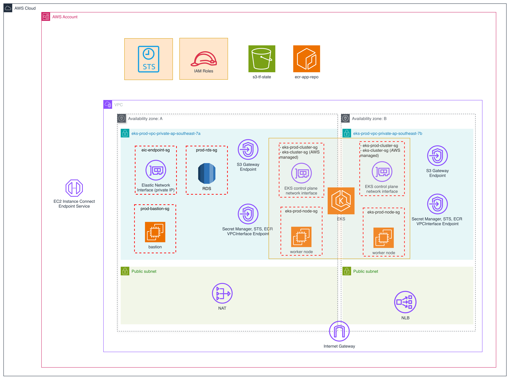

# Private EKS Cluster — GitOps on AWS

> **Tech stack:** Terraform · Terragrunt · Kubernetes · Helm · ArgoCD · Traefik · cert-manager · External Secrets Operator · Prometheus/Grafana · FastAPI

---

## 1. What Is This Project

A **production-grade private EKS cluster on AWS**, deployed via Infrastructure as Code and managed with GitOps. The cluster runs inside a private VPC — no public API endpoint, no direct SSH access. All operations go through a bastion host (EC2 Instance Connect, no key pair needed).

The project demonstrates two IaC deployment paths (plain Terraform and Terragrunt) and a full GitOps workload delivery pipeline using ArgoCD.



---

## 2. What Does This Project Do

| Layer | What it does |
|---|---|
| **Terraform / Terragrunt** | Provisions VPC, EKS, Bastion, ECR, RDS, IAM (IRSA), Secrets Manager, VPC Endpoints |
| **ArgoCD (GitOps)** | Watches this repo and syncs Helm chart changes to the cluster automatically |
| **Traefik** | Single entry-point reverse proxy — routes all subdomain traffic, terminates TLS |
| **cert-manager** | Requests and renews TLS certificates from Let's Encrypt (HTTP-01 challenge via Traefik) |
| **External Secrets Operator** | Syncs AWS Secrets Manager secrets into native Kubernetes Secrets |
| **helloworld (FastAPI)** | Sample app that reads secrets from environment variables injected via ESO |
| **Prometheus + Grafana** | Cluster observability — metrics scraping and dashboards |

### Traffic Flow

```
Internet
    │
    ▼
Squarespace DNS  CNAME → <subdomain>. {domain}.com → NLB DNS name
    │
    ▼
AWS NLB  :80 / :443  (created automatically by AWS Load Balancer Controller)
    │
    ▼
Traefik pods  (namespace: traefik)
    │  terminates TLS using cert-manager-issued Secret "traefik-tls"
    │  routes by hostname via IngressRoute CRDs
    ├──▶ argocd-server         (namespace: argocd)
    ├──▶ grafana-service        (namespace: monitoring)
    ├──▶ prometheus-service     (namespace: monitoring)
    ├──▶ helloworld-svc         (namespace: prod-app / dev-app)
    └──▶ traefik dashboard      (protected by basicAuth Middleware)

Private nodes pull images from ECR via VPC Interface Endpoints (no NAT traffic)
Bastion → EC2 Instance Connect Endpoint → kubectl / helm access (no public IP, no SSH key)
```

### Secret Flow

```
AWS Secrets Manager  →  ExternalSecret (ESO)  →  k8s Secret  →  Pod env var  →  main.py
     "prod/helloworld"      fetches JSON             "helloworld-secrets"    API_KEY
```

---

## 3. Technical Concepts

### Terraform

Plain Terraform lives in `terraform/`. One root module composes all child modules. Environment differences are expressed purely through `envs/dev.tfvars` and `envs/prod.tfvars`.

**Module breakdown:**

| Module | AWS Resources |
|---|---|
| `vpc/` | VPC, public (for NLB of EKS )/private (for EKS ) subnets, NAT Gateway, VPC Endpoints (ECR, STS, S3, Secrets Manager), Flow Logs |
| `eks/` | EKS cluster (private endpoint), managed node group, OIDC provider, add-ons (CoreDNS, kube-proxy, VPC CNI, EBS CSI) |
| `bastion/` | EC2 bastion + EC2 Instance Connect Endpoint via AWS Console (no public IP, no SSH key), IAM role scoped to S3 state bucket |
| `ecr/` | ECR repository per environment, lifecycle policy (keep last 10 images), image scanning on push |
| `iam/` | Three IRSA roles: `helloworld` (Secrets Manager read), `aws-load-balancer-controller` (EC2/ELB), `eks-secret-store-irsa` (ESO — Secrets Manager read scoped to `<env>/*`) |
| `secrets/` | One Secrets Manager secrets per env: JSON bundle (`<env>/helloworld`) consumed by ExternalSecret |
| `rds/` | RDS PostgreSQL in private subnets, security group allowing only EKS nodes |

**Key Terraform patterns used:**

- **IRSA (IAM Roles for Service Accounts)** — Each workload (helloworld, ESO, LBC) has its own IAM role. The role's trust policy uses the cluster's OIDC provider + `StringEquals` condition on the ServiceAccount `sub` claim. No node-level IAM permissions needed.
- **VPC Endpoints** — All private node traffic to AWS APIs (ECR, STS, Secrets Manager, S3) goes through Interface/Gateway endpoints — never over the NAT Gateway. Reduces cost and latency.
- **`-target` apply order** — VPC and EKS must exist before IAM (needs OIDC ARN) and Secrets (needs env). Use `-target` for first apply.

### Terragrunt

Terragrunt lives in `terragrunt/`. It wraps the **same Terraform modules** from `terraform/modules/` but adds:

- **Isolated state per module** — `s3://bucket/dev/vpc/terraform.tfstate`, `s3://bucket/dev/eks/terraform.tfstate`, etc. One module failure does not block others.
- **Automatic backend generation** — `terragrunt.hcl` at root auto-generates `backend.tf` and `provider.tf` for every child module. No copy-paste boilerplate.
- **Dependency graph** — `dependency {}` blocks declare explicit module ordering. `terragrunt run-all apply` resolves and executes in the correct order.
- **DRY environment values** — `live/dev/env.hcl` holds all dev values. Each module's `terragrunt.hcl` reads them via `read_terragrunt_config(find_in_parent_folders("env.hcl"))`. One place to change cluster name, CIDRs, node type, etc.


**Terragrunt vs plain Terraform — when to choose which:**

| | Plain Terraform | Terragrunt |
|---|---|---|
| State isolation | Single state file | Per-module state |
| DRY config | `tfvars` files | `env.hcl` + inheritance |
| Partial apply | `-target` flags | `cd module && terragrunt apply` |
| Dependency mgmt | Manual ordering | Automatic via `dependency {}` |

### Kubernetes / Helm

All K8s workloads are delivered via ArgoCD (GitOps). ArgoCD watches this repo and applies Helm charts from `k8s/charts/`.

**Helm chart breakdown:**

| Chart | What it deploys |
|---|---|
| `traefik/` | Traefik Deployment, Service (LoadBalancer → triggers LBC to create NLB), IngressRoutes for all subdomains, Middleware (basicAuth on dashboard), ClusterRole |
| `cert-manager/` | ClusterIssuer (Let's Encrypt ACME HTTP-01), Certificate (wildcard TLS stored as `traefik-tls` Secret in `traefik` namespace) |
| `secret-store/` | SecretStore (ESO — points to AWS Secrets Manager + IRSA ServiceAccount), ExternalSecret (syncs `<env>/helloworld` JSON → k8s Secret `helloworld-secrets`), ServiceAccount (IRSA-annotated) |
| `helloworld/` | Deployment (injects `API_KEY` from `helloworld-secrets` via `secretKeyRef`), Service, ServiceAccount (IRSA-annotated for direct Secrets Manager access) |
| `prometheus/` | ArgoCD Application using multi-source pattern — pulls `kube-prometheus-stack` chart from Helm registry + values from this repo |

**Key K8s concepts used:**

- **IRSA annotation on ServiceAccount** — `eks.amazonaws.com/role-arn` enables the pod to assume the IAM role. No static credentials anywhere.
- **ExternalSecret + SecretStore** — ESO polls AWS Secrets Manager every 1h and keeps `helloworld-secrets` up to date. `conversionStrategy: Default` unpacks JSON keys into individual Secret keys.
- **Traefik IngressRoute** — Traefik-native CRD (not K8s Ingress). Routes by `Host()` rule, attaches Middleware, references TLS Secret by name.
- **cert-manager HTTP-01 solver** — cert-manager creates a temporary `Ingress` on port 80 handled by Traefik to complete the Let's Encrypt challenge. After validation the cert is stored as a K8s Secret and mounted by Traefik.
- **AWS Load Balancer Controller** — Watches Services of `type: LoadBalancer` with annotation `service.beta.kubernetes.io/aws-load-balancer-type: external`. Creates and manages the NLB in AWS. Uses `nlb-target-type: ip` to send traffic directly to pod IPs (bypasses NodePort + kube-proxy).
- **ArgoCD GitOps** — Each chart is an ArgoCD `Application` CR. `automated.selfHeal: true` reverts any manual cluster changes. `automated.prune: true` removes resources deleted from Git.

---

## 4. Steps to Reproduce

### Prerequisites

```bash
# Local machine
brew install awscli terraform terragrunt kubectl helm docker

# Verify
aws --version          # >= 2.0
terraform --version    # >= 1.5.0
terragrunt --version   # >= 0.55.0
kubectl version --client
helm version
```

### Step 0 — Bootstrap State Backend

Create the S3 bucket and DynamoDB table **before** any Terraform/Terragrunt run:

```bash
export AWS_REGION="ap-southeast-7"
export ACCOUNT_ID=$(aws sts get-caller-identity --query Account --output text)
export STATE_BUCKET="eks-app-${ACCOUNT_ID}"

# S3 bucket
aws s3api create-bucket \
  --bucket "${STATE_BUCKET}" \
  --region "${AWS_REGION}" \
  --create-bucket-configuration LocationConstraint="${AWS_REGION}"

aws s3api put-bucket-versioning \
  --bucket "${STATE_BUCKET}" \
  --versioning-configuration Status=Enabled

# DynamoDB table for state locking
aws dynamodb create-table \
  --table-name terraform-locks \
  --attribute-definitions AttributeName=LockID,AttributeType=S \
  --key-schema AttributeName=LockID,KeyType=HASH \
  --billing-mode PAY_PER_REQUEST \
  --region "${AWS_REGION}"
```

Update `tfstate_bucket` in `terraform/envs/dev.tfvars`, `prod.tfvars` and `terragrunt/live/dev/env.hcl`, `prod/env.hcl` to match.

---

### Option A — Plain Terraform

#### Step 1 — Configure environment values

Edit `terraform/envs/dev.tfvars`:
- Set `admin_principal_arns` to your IAM ARN: `aws sts get-caller-identity --query Arn --output text`
- Set `tfstate_bucket` to the bucket created above

#### Step 2 — Apply infrastructure (first pass — no OIDC-dependent resources)

> **Why two applies?**
>
> `module.iam` references `module.eks.oidc_provider_arn` as an input — Terraform sees this and correctly orders `eks` before `iam`. However, on the **very first apply** the cluster does not exist yet, so `oidc_provider_arn` is `(known after apply)` during the plan phase. When Terraform tries to plan `module.iam` at the same time, this unknown value cascades into the `jsonencode()` trust policy expression and causes a plan-time error.
>
> Using `-target` on the first apply forces EKS to fully provision first, making `oidc_provider_arn` a **known concrete value** in state. The second `terraform apply` (no `-target`) can then plan and create IAM cleanly. All subsequent applies after the first work in a single run.

```bash
cd terraform

terraform init -backend-config=envs/dev.s3.tfbackend

# Apply VPC, EKS, Bastion, ECR first (OIDC ARN not available yet)
terraform apply -var-file="envs/dev.tfvars" \
  -target=module.vpc \
  -target=module.bastion \
  -target=module.eks \
  -target=module.ecr
```

#### Step 3 — Apply remaining resources (IAM IRSA, Secrets)

```bash
# IAM needs OIDC ARN from EKS
terraform apply -var-file="envs/dev.tfvars"
```

#### Step 4 — Note the outputs

```bash
terraform output helloworld_irsa_role_arn   # → paste into k8s/charts/helloworld/values-dev.yaml
terraform output eso_role_arn               # → paste into k8s/charts/secret-store/values-dev.yaml
terraform output lbc_role_arn               # → used when installing AWS LBC via Helm
```

---

### Option B — Terragrunt

#### Step 1 — Configure environment values

Edit `terragrunt/live/dev/env.hcl`:
- Set `account_id` to your AWS account ID
- Set `admin_principal_arns` to your IAM ARN
- Set `tfstate_bucket` to the bucket created in Step 0

#### Step 2 — Deploy all modules in dependency order

```bash
cd terragrunt/live/dev

export TF_VAR_helloworld_api_key_value="your-actual-api-key"

terragrunt run-all apply
```

Or deploy module by module:

```bash
cd terragrunt/live/dev/vpc      && terragrunt apply
cd ../bastion                   && terragrunt apply
cd ../ecr                       && terragrunt apply
cd ../eks                       && terragrunt apply   # needs vpc + bastion
cd ../                          # iam, secrets apply last (need OIDC)
terragrunt run-all apply --terragrunt-include-dir iam
```

#### Step 3 — Collect outputs

```bash
cd terragrunt/live/dev/iam && terragrunt output eso_role_arn
```

---

### Step 5 — Update Helm values with Terraform outputs

Paste the role ARNs from Terraform outputs into the Helm values files:

```yaml
# k8s/charts/helloworld/values-dev.yaml
serviceAccount:
  roleArn: "arn:aws:iam::<ACCOUNT_ID>:role/dev-helloworld"   # from terraform output helloworld_irsa_role_arn

# k8s/charts/secret-store/values-dev.yaml
serviceAccount:
  irsaRoleArn: "arn:aws:iam::<ACCOUNT_ID>:role/dev-eks-secret-store-irsa"  # from terraform output eso_role_arn
  
# k8s/charts/secret-store/values-dev.yaml
externalSecret:
  name: helloworld-secrets
  key: "dev/helloworld"   # must match the secret name in Secrets Manager
```

---

### Step 6 — Connect to the cluster via Bastion

> **Why can you connect to a bastion with no public IP?**
>
> Your bastion sits in a **private subnet** (`associate_public_ip_address = false`) with **no public IP and no inbound rule from the internet**. Connection is possible because Terraform provisions an **EC2 Instance Connect Endpoint (EICE)** inside the same VPC. EICE acts as a managed SSH proxy — AWS tunnels the connection from your browser or CLI through the endpoint into the private subnet.
>
> **Security group design:** two separate SGs enforce least-privilege:
> - `eic-endpoint-sg` — only one egress rule: port 22 TCP **to** `bastion-sg`
> - `bastion-sg` — only one ingress rule: port 22 TCP **from** `eic-endpoint-sg`
>
> No inbound 0.0.0.0/0, no key pair stored anywhere. The only path in is through the EICE.

**Option 1 — AWS CLI** (requires AWS CLI >= 2.12)

```bash
# Get bastion instance ID
INSTANCE_ID=$(aws ec2 describe-instances \
  --filters "Name=tag:Name,Values=dev-bastion" "Name=instance-state-name,Values=running" \
  --query "Reservations[0].Instances[0].InstanceId" \
  --output text --region ap-southeast-7)

# Connect — AWS CLI generates a temp key, pushes it through the EICE, tunnels SSH automatically
aws ec2-instance-connect ssh \
  --instance-id "${INSTANCE_ID}" \
  --region ap-southeast-7
```

**Option 2 — AWS Console**

```
EC2 → Instances → select dev-bastion → Connect → EC2 Instance Connect tab → Connect
```

The console uses the same EICE tunnel — no key pair required.

```bash
# On bastion — kubeconfig is pre-configured by user_data
kubectl get nodes
```

---

This is handled automatically by the **GitHub Actions CI/CD pipeline** (`.github/workflows/ci-cd-pipeline.yaml`). You do not need to build or push manually.

**Trigger:** push a Git tag matching `v*` or `release/**`

```bash
# Simulate a software team releasing a new version
git tag v1.0.0
git push origin v1.0.0
```

**What the pipeline does:**

```
Tag pushed (v*  or  release/**)  
    │
    ▼
[build-scan-push job]
  1. Authenticates to AWS via OIDC (no static credentials)
  2. Logs in to ECR
  3. docker build  -f app/helloworld/Dockerfile
  4. docker push   <ECR_REGISTRY>/<ECR_REPOSITORY>:<tag-name>
     (image tag = the Git tag name, e.g. v1.0.0)
    │
    ▼
[update-argocd-values job]  (runs after build-scan-push)
  5. Checks out main branch
  6. Updates values-dev.yaml:
       image.repository = <ECR_REGISTRY>/<ECR_REPOSITORY>
       image.tag        = v1.0.0
  7. Commits and pushes the change back to main
    │
    ▼
ArgoCD detects values-dev.yaml changed → syncs → rolling update on cluster
```

**Required GitHub repository variables** (set under Settings → Variables → Actions):

| Variable | Example value |
|---|---|
| `AWS_REGION` | `ap-southeast-7` |
| `ECR_REGISTRY` | `<ACCOUNT_ID>.dkr.ecr.ap-southeast-7.amazonaws.com` |
| `ECR_REPOSITORY` | `dev-helloworld` |
| `AWS_ROLE_TO_ASSUME` | `arn:aws:iam::<ACCOUNT_ID>:role/github-actions-ecr-push` |

> **Note:** `AWS_ROLE_TO_ASSUME` must be an IAM role with an OIDC trust policy for `token.actions.githubusercontent.com` and permissions for `ecr:GetAuthorizationToken`, `ecr:BatchCheckLayerAvailability`, `ecr:PutImage`, `ecr:InitiateLayerUpload`, `ecr:UploadLayerPart`, `ecr:CompleteLayerUpload`. The Trivy image scan and SAST steps are present in the pipeline but currently commented out — uncomment them to enforce security gates before push.
>
> **This role and the GitHub OIDC provider are now managed by Terraform** (`modules/iam/main.tf`). After running `terraform apply`, collect the role ARN and register it in GitHub:
>
> ```bash
> # Get the role ARN from Terraform output
> terraform output github_actions_role_arn
> ```
>
> Then go to your GitHub repository → **Settings → Secrets and variables → Actions → Variables** and set `AWS_ROLE_TO_ASSUME` to the ARN above.
>
> **One-time account setup:** The GitHub OIDC provider (`token.actions.githubusercontent.com`) is an AWS-account-level resource. Terraform creates it only when `create_github_oidc_provider = true` — set in `dev.tfvars` only. The `prod.tfvars` sets it to `false` to avoid a duplicate resource error. If you skip the dev environment and apply prod first, set `create_github_oidc_provider = true` in `prod.tfvars` instead.

---

### Step 8 — Install ArgoCD on the cluster (from bastion)

```bash
# Install ArgoCD
kubectl create namespace argocd
helm repo add argo https://argoproj.github.io/argo-helm
helm install argocd argo/argo-cd \
  --namespace argocd \
  --version 6.7.0

# Get initial admin password
kubectl get secret argocd-initial-admin-secret \
  -n argocd -o jsonpath="{.data.password}" | base64 -d
```

---

### Step 9 — Install AWS Load Balancer Controller (from bastion)

```bash
LBC_ROLE_ARN=$(terraform -chdir=/path/to/terraform output -raw lbc_role_arn)

helm repo add eks https://aws.github.io/eks-charts
helm install aws-load-balancer-controller eks/aws-load-balancer-controller \
  --namespace kube-system \
  --set clusterName=dev-eks \
  --set serviceAccount.annotations."eks\.amazonaws\.com/role-arn"="${LBC_ROLE_ARN}"
```

---

### Step 10 — Apply ArgoCD Application manifests (GitOps handoff)

From this point ArgoCD manages everything. Apply each `Application` CR once — ArgoCD will sync and maintain the state forever.

```bash
# Deploy in this order (CRDs must exist before resources that use them)

# 1. External Secrets Operator (installs ESO CRDs)
kubectl apply -f k8s/gitops/argocd/applications/external-secret-operator/argocd-external-secret-manager.yaml

# 2. SecretStore + ExternalSecret (uses ESO CRDs)
kubectl apply -f k8s/gitops/argocd/applications/secret-store/argocd-external-secret-manager.yaml

# 3. Traefik (creates NLB via LBC)
kubectl apply -f k8s/gitops/argocd/applications/app-traefik/argocd-app-traefik.yaml

# 4. cert-manager (creates ClusterIssuer + Certificate — needs Traefik on port 80)
kubectl apply -f k8s/gitops/argocd/applications/cert-manager/argocd-cert-manager.yaml

# 5. helloworld app
kubectl apply -f k8s/gitops/argocd/applications/app-helloworld/argocd-app-helloworld.yaml

# 6. Prometheus + Grafana
kubectl apply -f k8s/gitops/argocd/applications/app-pometheus/argocd-app-prometheus.yaml
```

Watch sync status:
```bash
kubectl get applications -n argocd
```

---

### Step 11 — Configure DNS (Squarespace)

DNS is managed directly in Squarespace — no Terraform needed. After Traefik is running, get the NLB DNS name:

```bash
# Get the NLB hostname assigned by AWS LBC
kubectl get svc traefik -n traefik -o jsonpath='{.status.loadBalancer.ingress[0].hostname}'
# Output example: abc123.elb.ap-southeast-7.amazonaws.com
```

Then in **Squarespace → Domains → DNS Settings**, add one CNAME record per subdomain:

| Host | Type | Value |
|---|---|---|
| `argocd` | CNAME | `<NLB-DNS-NAME>` |
| `grafana` | CNAME | `<NLB-DNS-NAME>` |
| `helloworldapp` | CNAME | `<NLB-DNS-NAME>` |
| `userapp` | CNAME | `<NLB-DNS-NAME>` |
| `prometheus` | CNAME | `<NLB-DNS-NAME>` |
| `traefik` | CNAME | `<NLB-DNS-NAME>` |

> **Note:** Squarespace does not support ALIAS/ANAME records. Use CNAME — this works for all subdomains. DNS propagation typically takes a few minutes to 1 hour.
>
> cert-manager's HTTP-01 challenge requires the CNAME to resolve **before** ArgoCD syncs the cert-manager chart. Apply the cert-manager ArgoCD Application only after DNS is propagating.

---

### Step 12 — Verify

```bash
# All pods running
kubectl get pods -A

# TLS cert issued
kubectl get certificate -n traefik

# Test endpoints
curl https://helloworldapp.{domain}.com/health
curl https://helloworldapp.{domain}.com/secret-check
```

---

## Environment Reference

| Setting | Dev | Prod |
|---|---|---|
| EKS cluster | `eks-dev` | `eks-prod` |
| VPC CIDR | `10.4.0.0/16` | `10.5.0.0/16` |
| Node type | `t3.large` | `t3.medium` |
| Desired nodes | 2 | 3 |
| NAT Gateway | Single | Single (HA: set `is_single_nat_gateway = false`) |
| App namespace | `dev-app` | `prod-app` |
| AWS secret path | `dev/helloworld` | `prod/helloworld` |
| Image tag mutability | `MUTABLE` | `IMMUTABLE` |

---

## Destroy

```bash
# Terraform
cd terraform
terraform destroy -var-file="envs/dev.tfvars"

# Terragrunt (destroys in reverse dependency order)
cd terragrunt/live/dev
terragrunt run-all destroy
```

> **Note:** Delete ArgoCD Applications and any NLBs created by LBC **before** running destroy, or the VPC destroy will fail (AWS won't delete VPCs with active load balancers).
